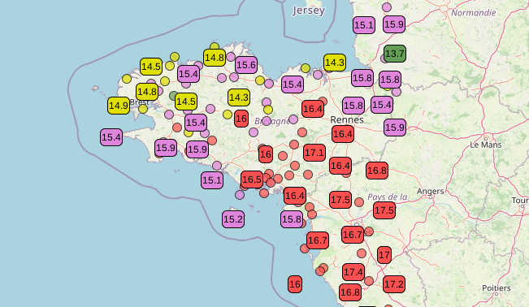

Leaflet.inflatable-markers-layer
================================

The plugin can be seen as an alternative to the most excellent [Leaflet marker cluster plugin](https://github.com/Leaflet/Leaflet.markercluster).

When you have many markers on a map, it can become unreadable. This plugin gives
markers two states : an inflated state (the normal state) which takes up some
space and a deflated state which takes up much less space and is used to
declutter the map. The plugin computes for each marker the list of markers that
cannot be inflated at the same time without collisioning and making the map
messy. Right-clicking on a marker toggles between the inflated and deflated
states and when a marker is inflated, all collisioning markers are deflated to
make room for it.

Have a look at the [demo page](https://meteo-concept.github.io/leaflet-inflatable-markers-group)
to see what it looks like.


Install
-----

Once this plugin stabilizes a little, we'll publish it to the usual channels for
consumption through npm, yarn, etc. It's just not stable and tested enough for
now.

### Manually

Download the [latest release](https://github.com/Meteo-Concept/leaflet-inflatable-markers-layer) and include it in your app.


Usage
-----

Where you would use a `L.LayerGroup`, use an `L.InflatableMarkersGroup` instead.
The difference with the base `L.LayerGroup` object is that you must provide a
`iconCreateFunction` option and you must give the icons you add to the group a
defined size.
The `iconCreateFunction` will be used to construct the deflated versions of the
markers and the icon size is used to compute the collisions.

See file `index.html` in the example folder for a simple demo of a map with
many temperature labels on it. Note that the plugin tries to inflate as many
markers as possible without causing collisions when zooming and dezooming.

In the example, we've used a circle as the deflated version of the markers and
labels in the inflated version.



Development
-----

You can use the example folder for testing.

```
npm run release   # minify js and copy leaflet.inflatable-markers-group.min.js in example folder
```


Changelog
-----

### 0.1.0
Initial version


Authors
-------

[](https://www.meteo-concept.fr)
